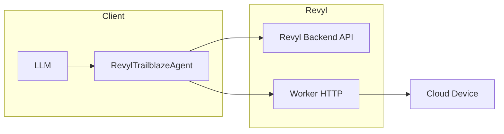

# Revyl Cloud Device Integration

Trailblaze can use [Revyl](https://revyl.ai) cloud devices instead of local ADB or Maestro. This lets you run the same AI-powered tests against managed Android (and iOS) devices without a local device or emulator.

## Overview

The Revyl integration provides:

- **RevylTrailblazeAgent** – A standalone `TrailblazeAgent` that maps Trailblaze tools to Revyl HTTP APIs (no Maestro).
- **RevylDeviceService** – Provisions and lists cloud devices via the Revyl backend.
- **RevylMcpServerFactory** – Builds an MCP server that uses Revyl for device communication.

All integration code lives under `trailblaze-host/src/main/java/xyz/block/trailblaze/host/revyl/`.

## Prerequisites

- A Revyl account and API key.
- [Revyl CLI](https://github.com/revyl/revyl-cli) (optional but recommended for session management and debugging).

Set environment variables:

- `REVYL_API_KEY` – Your Revyl API key (required).
- `REVYL_BACKEND_URL` – Backend base URL (optional; defaults to production).

## Architecture



1. The LLM calls Trailblaze tools (tap, inputText, swipe, etc.).
2. **RevylTrailblazeAgent** maps each tool to Revyl operations.
3. **RevylWorkerClient** sends HTTP requests to the Revyl backend (session, device) and to the worker (screenshot, tap, type, swipe, etc.).
4. The worker drives the cloud device (Android/iOS).

## MCP server usage

Use **RevylMcpServerFactory** to create an MCP server that provisions a Revyl device and runs the agent:

```kotlin
val server = RevylMcpServerFactory.create(
    backendBaseUrl = System.getenv("REVYL_BACKEND_URL") ?: "https://backend.revyl.ai",
    apiKey = System.getenv("REVYL_API_KEY") ?: error("REVYL_API_KEY required"),
)
// Use server with your MCP client
```

The factory starts a device session, builds a **RevylMcpBridge** with **RevylTrailblazeAgent**, and returns a **TrailblazeMcpServer** that speaks MCP.

## Supported operations

| Trailblaze tool   | Revyl implementation                          |
|-------------------|-----------------------------------------------|
| tap               | POST /input (tap at coordinates)             |
| inputText         | POST /input (typeText; optional clear_first)  |
| swipe             | POST /input (swipe)                           |
| longPress         | POST /input (longPress)                       |
| launchApp         | POST /session/launch_app                      |
| installApp        | POST /session/install_app                     |
| eraseText         | typeText with clear_first + space             |
| getScreenState    | GET screenshot + minimal hierarchy            |

Screenshots and view hierarchy are provided by the Revyl worker; hierarchy may be minimal compared to a full Maestro tree.

## Limitations

- No local ADB or Maestro; all device interaction goes through Revyl.
- View hierarchy from Revyl may be reduced (e.g. dimensions only, empty tree).
- Requires network access to Revyl backend and worker.

## See also

- [Architecture](architecture.md) – Revyl as an alternative to HostMaestroTrailblazeAgent.
- [Revyl CLI](https://github.com/revyl/revyl-cli) – Command-line tool for devices and tests.
