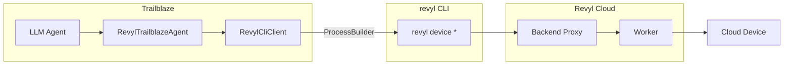

# Revyl Cloud Device Integration

Trailblaze can use [Revyl](https://revyl.ai) cloud devices instead of local ADB or Maestro. This lets you run the same AI-powered tests against managed Android and iOS devices without a local device or emulator.

## Overview

The Revyl integration provides:

- **RevylCliClient** – Shells out to the `revyl` CLI binary for all device interactions. Auto-downloads the CLI if not already installed.
- **RevylTrailblazeAgent** – Maps every Trailblaze tool to a `revyl device` CLI command.
- **RevylMcpServerFactory** – Builds an MCP server that provisions a Revyl cloud device and routes tool calls through the CLI.

All integration code lives under `trailblaze-host/src/main/java/xyz/block/trailblaze/host/revyl/`.

## Prerequisites

Set one environment variable:

- `REVYL_API_KEY` – Your Revyl API key (required).

That's it. The `revyl` CLI binary is **auto-downloaded** from [GitHub Releases](https://github.com/RevylAI/revyl-cli/releases) on first use if not already on PATH. No manual install needed.

**Optional overrides:**

- `REVYL_BINARY` – Path to a specific `revyl` binary (skips auto-download and PATH lookup).

## Architecture



1. The LLM calls Trailblaze tools (tap, inputText, swipe, etc.).
2. **RevylTrailblazeAgent** dispatches each tool to **RevylCliClient**.
3. **RevylCliClient** runs the corresponding `revyl device` command via `ProcessBuilder` and parses the JSON output.
4. The `revyl` CLI handles auth, backend proxy routing, and AI-powered target grounding transparently.
5. The cloud device executes the action and returns results.

## Quick start

```kotlin
// Only prerequisite: set REVYL_API_KEY in your environment
val client = RevylCliClient()  // auto-downloads revyl if not on PATH

// Start a cloud device with an app installed
val session = client.startSession(
    platform = "android",
    appUrl = "https://example.com/my-app.apk",
)
println("Viewer: ${session.viewerUrl}")

// Interact using natural language targets
client.tapTarget("Sign In button")
client.typeText("user@example.com", target = "email field")
client.tapTarget("Log In")

// Screenshot
client.screenshot("after-login.png")

// Clean up
client.stopSession()
```

## MCP server usage

Use **RevylMcpServerFactory** to create an MCP server backed by Revyl:

```kotlin
val server = RevylMcpServerFactory.create(platform = "android")
server.startStreamableHttpMcpServer(port = 8080, wait = true)
```

The factory auto-downloads the CLI, provisions a cloud device, and returns a **TrailblazeMcpServer** that speaks MCP.

## Supported operations

All 12 Trailblaze tools are fully implemented:

| Trailblaze tool | CLI command |
|-----------------|-------------|
| tap (coordinates) | `revyl device tap --x N --y N` |
| tap (grounded) | `revyl device tap --target "..."` |
| inputText | `revyl device type --text "..." [--target "..."]` |
| swipe | `revyl device swipe --direction <dir>` |
| longPress | `revyl device long-press --target "..."` |
| launchApp | `revyl device launch --bundle-id <id>` |
| installApp | `revyl device install --app-url <url>` |
| eraseText | `revyl device clear-text` |
| pressBack | `revyl device back` |
| pressKey | `revyl device key --key ENTER` |
| openUrl | `revyl device navigate --url "..."` |
| screenshot | `revyl device screenshot --out <path>` |

## Limitations

- No local ADB or Maestro; all device interaction goes through Revyl cloud devices.
- View hierarchy from Revyl is minimal (screenshot-based AI grounding is used instead).
- Requires network access to Revyl backend and GitHub (for auto-download on first use).

## See also

- [Architecture](architecture.md) – Revyl as an alternative to HostMaestroTrailblazeAgent.
- [Revyl CLI](https://github.com/RevylAI/revyl-cli) – Command-line tool for devices and tests.
- [Revyl docs](https://docs.revyl.ai) – Full CLI and SDK documentation.
