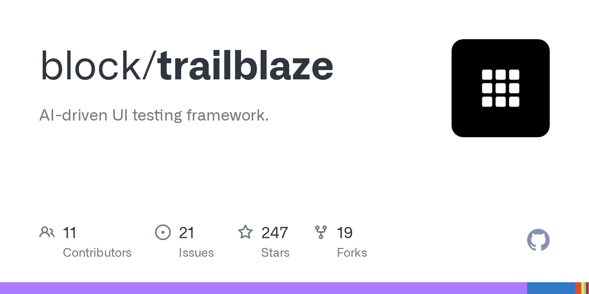
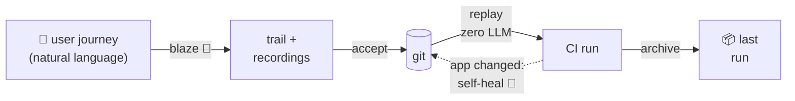

# Trailblaze
## Map Your App for AI

<div class="pt-8 text-2xl opacity-70" style="letter-spacing:0.6em; text-indent:0.6em;">🥾🗺️</div>

<div class="pt-8 text-lg opacity-70 tracking-wide">
Droidcon USA 2026<br>Sam Edwards · Block
</div>

<style>
/* Back-of-room legibility: enlarge default markdown bullet lists deck-wide. */
/* Raw markdown lists only; explicitly-sized custom slides are untouched. */
.slidev-layout ul > li {
  font-size: 1.5rem;
  line-height: 1.55;
  margin-top: 0.45rem;
}
.slidev-layout ul > li ul > li {
  font-size: 1.15rem;
}
</style>

<!--
DECK v8 — SPINE REFRAMED (plane review, 2026-07-15): the through-line is VISIBILITY /
COMPREHENSION — "you can't see what you're testing" — and the MAP is the destination.
Determinism/recordability are the ENABLER, not the headline. Arc: one screenshot (2016) →
readable trails → your whole app as a map (2026).
Act 0 order now: ten-years HOOK (can't see what we test) → the user-journey unit → AI could
do it all but not how we need it (hype + missing-link merged) → it's not that easy yet →
what Trailblaze is (intro trio collapsed) → three differentiators → "any target" grid
(seven-targets folded into differentiator #3).
Content-complete; all four 📼 asset slides carry REAL embedded media (real runs, real numbers).
Act + timing markers (and ASSET ids) live top-left of each slide but are HIDDEN by
default via `.act-label { display: none }` in styles/index.css — flip to `block` for rehearsal.
Enabler line (Act 1): natural language on top, determinism underneath. Refrain: "Blaze once, trail forever."
samdroidcon-notes.md = source of truth: changelog, cut-priority list, Plan B, Q&A bank.
-->

---
layout: center
---

<div class="act-label text-sm opacity-50 absolute top-4 left-4">ACT 0 · The problem · 0:00–3:00</div>

# Ten years on this problem

<div class="pt-2 text-2xl opacity-80 max-w-3xl mx-auto text-center">

We're still shipping mobile apps — and we still can't **see** what our tests cover, or tie them back to what the product actually wants.

</div>

<div class="grid grid-cols-2 gap-10 pt-6 max-w-4xl mx-auto">
  <div class="text-center">
    
    <div class="pt-3 text-lg"><b>2016</b> — <i>"A Screenshot is Worth 1,000 Words"</i></div>
  </div>
  <div class="text-center">
    
    <div class="pt-3 text-lg"><b>2025</b> — <i>"AI Driven Mobile Testing"</i> · Brian Gardner</div>
  </div>
</div>

<div class="pt-6 text-center text-lg opacity-70">

*By the end you'll see what the map is — and that you're already building it.*

</div>

<!--
THE HOOK (plane review, 2026-07-15 — the reframe). Open COLD on the problem, not on
credentials. The deck's spine is now VISIBILITY / COMPREHENSION — you can't see what
you're testing — and the MAP is the destination (it's the title).
BEAT: ten years shipping mobile; Espresso is still the fastest way to RUN tests, but we
still can't SEE what we're testing or trace it to what the product wants.
2016 CALLBACK: "A Screenshot is Worth 1,000 Words" — Sam couldn't tell what the tests did
from the filenames. THIS 1,000-WORDS LINE IS A PLANT — it pays off as "1,000 tokens" at the
reports slide (Act 3). Open with words here, pay off with tokens there.
Both prior talks were Droidcon NYC; 2025 = open-sourcing Trailblaze on this stage with
Brian ("a lot has happened since"). Credentials in passing, no dwelling — the problem is
the point. Images: matched cards, both true 16:9 (2025's YouTube letterbox cropped off).
HAND-OFF into the unit: "The thing we're trying to protect has a name — the user journey."
-->

---

<div class="act-label text-sm opacity-50 absolute top-4 left-4">ACT 0 · The unit</div>

# One user journey.

<div class="pt-6 text-2xl opacity-70">

what a user must **always** be able to do — the unit of quality

</div>

<div class="pt-10 text-4xl">

You write it **once**.

</div>

<!--
THE QUALITY UNIT — moved up to right after the hook (plane review). What the product
actually wants, named. Industry term: critical user journey (CUJ) — the experiences a
user must always be able to complete; the things needed for sign-off before release.
BUILD: say it and let it hang — "One user journey. You write it once." Login is just the
spoken example ("say, logging in"); don't dwell on login.
HONESTY (still true): each journey is written once — MFA, first-time setup are their own
journeys. What you get is a TRAILHEAD, and within it you can skip the normal noise so
replay starts from known state. Trailheads get their formal slide in Act 2 — don't unpack.
HAND-OFF: "So the obvious move is to point AI at it."
-->

---
layout: center
---

<div class="act-label text-sm opacity-50 absolute top-4 left-4">ACT 0 · The turn · 3:00–6:00</div>

# AI could do it all — just not how we need it

<div v-click class="pt-6 text-3xl italic opacity-90">

"Validate the cart updates — make it a test."

</div>

<div v-click class="pt-6 text-2xl">

It drives a real phone. It just… **does it.** *(genuinely magic the first time.)*

</div>

<div v-click class="pt-6 text-2xl">

But an **LLM on every run** is <b>slow · expensive · non-deterministic</b> — magic for exploring, **brutal for CI.**

</div>

<div v-click class="pt-6 text-2xl">

And it **throws away the link:** what *exactly* did it do? can you rerun it deterministically? the **objective is gone.**

</div>

<!--
MERGED (plane review, 2026-07-15 — Sam): the old "AI is supposed to do everything"
hype/economics slide + "The missing link" slide collapse into ONE quick turn. Four beats,
click-built:
1. AI is supposed to do everything — a real ask from a real backlog.
2. The dream is REAL — it DRIVES A REAL PHONE. Honor the upside (great for exploring, and
   for agents driving devices — one of the two hard problems: device control).
3. First catch — CI ECONOMICS: slow/expensive/non-deterministic on every run.
4. Second catch — it DISCARDS THE LINK: no durable record of what it did, no deterministic
   rerun, and the objective (the most valuable artifact) is thrown away. "Losing the link"
   is the phrase to hit.
Deterministic replay answers beat 3 (replay alone is table stakes — Maestro has it too);
KEEPING the natural-language objective answers beat 4 — that's the whole Trailblaze thesis,
teased here. SAY the cart moment, don't demo it (Sam: "call it out" — kept lean). ASSET A
(blaze vs replay, 6m26s vs 2m20s) is the visual proof later; the reports slide pays off "what
exactly did it do?"
-->

---
layout: center
---

<div class="act-label text-sm opacity-50 absolute top-4 left-4">ACT 0</div>

# It's not that easy — yet

<div v-click class="pt-8 text-3xl">

A reliable trail takes **many cycles** — not one shot.

</div>

<div v-click class="pt-8 text-2xl">

**Trailheads** get the agent started · iterate from **recorded trails**.

</div>

<div v-click class="pt-8 text-lg opacity-60">

Coming: a **waypoint map** *(experimental)* — fewer cycles still.

</div>

<!--
KEEP (Sam confirmed, 2026-07-15). The honest counterweight, now positioned right after the
AI-turn: the dream (agent drives the cart) is real, but getting a RELIABLE trail out of it
is not one-shot. Give the room space to sit in this — it earns trust and motivates the whole
rest of the talk (the determinism/replay machinery exists precisely because one-shot isn't
enough).
BEATS (Sam's raw points, short bullets):
- Reliable trail authoring currently takes MANY CYCLES — we're finding this in practice.
- It probably will NEVER be perfectly one-shot — but we keep making it better ("— yet").
- TRAILHEADS help: the agent knows where to START (teaser — formal slide in Act 2).
- The loop: RECORDED TRAILS + the NATURAL-LANGUAGE STEPS give the agent concrete material
  to iterate against, not a blank page.
- WAYPOINTS (experimental) PLANTS the Act 6 payoff — keep it a QUIET forward-look (dim, one
  line); the real reveal is "Your app, as a map." Say it, don't dwell.
-->

---
layout: center
---

<div class="act-label text-sm opacity-50 absolute top-4 left-4">ACT 0 · What is Trailblaze? · 6:00–8:00</div>

# So — what *is* Trailblaze?

<div class="grid grid-cols-2 gap-10 items-center pt-4">

<div>

</div>

<div class="space-y-5">

<div v-click class="text-xl">

An **AI-driven UI testing framework.**
**Open source**, Apache-2.0 · <span class="opacity-70">github.com/block/trailblaze</span>

</div>

<div v-click class="text-xl">

Used at **Square** & **Cash App** — real apps, real devices, **every day, in CI.**

</div>

<div v-click>

```bash
brew install block/tap/trailblaze
```

<div class="pt-2 text-lg opacity-80">Open sourced on this stage last year — a lot has happened since.</div>

</div>

</div>

</div>

<!--
COLLAPSED (plane review, 2026-07-15 — Sam): the intro trio (First — what is Trailblaze? /
How we got here / And we use it) folds into this ONE identity beat, placed AFTER the
problem/journey setup so the problem explains WHY it's shaped this way.
Say it flat: "Trailblaze is an AI-driven UI testing framework — built at Block, open source,
Apache-2.0, on GitHub right now." Then the realness: Square + Cash, every day in CI — a
PRODUCTION-LESSONS talk, not a pitch.
TIMELINE as ONE spoken line (was its own slide): proof-of-concept Nov 2024 → full-time +
named Mar 2025 → open sourced at Droidcon NYC last year with Brian → brew install last month.
Don't dwell; don't name the pre-POC predecessor.
The GitHub card is GitHub's own OG render (org, Apache-2.0, contributors, activity) — reads
as "real project," which is this slide's whole job. Renders LIGHT on the dark deck on purpose.
DON'T say the star count aloud (247 is honest but modest). NUMBERS as of 2026-07-14: 247
stars · 19 forks · 11 contributors · 21 open issues (auto-updates in the OG card).
HAND-OFF: "So why is it shaped this way? Three things."
-->

---
layout: center
---

<div class="act-label text-sm opacity-50 absolute top-4 left-4">ACT 0 · Why Trailblaze · 8:00–9:00</div>

# Three things make it different

<div class="pt-8 space-y-6 text-2xl max-w-3xl mx-auto text-left">
  <div v-click><b>1 · Natural language</b> — plus <b>recorded, deterministic</b> replay</div>
  <div v-click><b>2 · Your custom tools</b> — first-class citizens to the LLM</div>
  <div v-click><b>3 · Consistent across targets</b> — iOS, Android, and any target you choose</div>
</div>

<!--
Sam's VERBATIM differentiators (plane review §5, VOICE SOURCE OF TRUTH): "natural language,
but we have the recorded deterministic tools, and the tools are your contributed custom tools
provided as first-class citizens to the LLM, and it's consistent across iOS and Android and
other platforms that you choose the target."
CI-cost/determinism is now the SUPPORT line under #1, NOT a headline (that's the reframe).
The two hard problems (device control · protecting user journeys) are SPOKEN here if you want
the framing — not a bullet.
SEVEN-TARGETS scale FOLDS INTO #3 (Sam's call, 2026-07-15) — the device grid on the next slide
makes #3 concrete rather than being its own abstract gut-punch beat.
HAND-OFF into the grid: "and 'any target' is not hypothetical."
-->

---

<div class="act-label text-sm opacity-50 absolute top-4 left-4">ACT 0 · Why Trailblaze · #3</div>

# "Any target" — made concrete

<div class="grid grid-cols-7 gap-3 pt-8 text-center text-sm">
<div><div class="h-20 flex items-end justify-center"><ph-device-mobile-speaker class="text-7xl opacity-90" /></div><div class="pt-2">Android<br>phone</div></div>
<div><div class="h-20 flex items-end justify-center"><ph-device-tablet-speaker class="text-7xl opacity-90" /></div><div class="pt-2">Android<br>tablet</div></div>
<div><div class="h-20 flex items-end justify-center"><ph-device-mobile-camera class="text-7xl opacity-90" /></div><div class="pt-2">iPhone</div></div>
<div><div class="h-20 flex items-end justify-center"><ph-device-tablet-camera class="text-7xl opacity-90" /></div><div class="pt-2">iPad</div></div>
<div><div class="h-20 flex items-end justify-center"></div><div class="pt-2">Square<br><b>Terminal</b></div></div>
<div><div class="h-20 flex items-end justify-center"></div><div class="pt-2">Square<br><b>Handheld</b></div></div>
<div><div class="h-20 flex items-end justify-center"></div><div class="pt-2">Square<br><b>Register</b></div></div>
</div>

<div class="pt-10 text-xl opacity-80">

One journey · seven targets · **hundreds of trails today.**

</div>

<!--
FOLDED INTO DIFFERENTIATOR #3 (Sam's call, 2026-07-15): the 7-device grid is no longer a
standalone "Seven targets" abstract beat — it's #3 made concrete. The grid IS the gut-punch:
one journey, seven places.
Square imagery = real product shots (droidcon/public/square-*.png, from squareup.com hardware
marketing). Consumer devices = Phosphor line icons (speaker-variant = Android, camera-variant
= Apple) — cleaner than emoji next to the real product shots.
SEVEN targets — never say eight (Sam round 8: "let go of the 8, 7 is fine"). Web via Playwright
is an additional platform the driver covers — mention freely, don't renumber, don't hedge.
Scale framing: keep the automatable automated; manual testing focuses on new features +
hardware-specific work automation can't reach yet.
HAND-OFF into Act 1: "One thesis makes all seven work the same way."
-->

---
layout: center
---

<div class="act-label text-sm opacity-50 absolute top-4 left-4">ACT 1 · The thesis · 4:00–9:00</div>

# Blaze once, trail forever.

<div class="pt-6 text-xl opacity-80">

Natural language → agent drives the real app →
saved as a **trail** → replayed with **zero LLM calls**

</div>

<!--
THE REFRAIN. Introduce here, echo at the close.
REFRAMED (plane review, 2026-07-15): natural language on top (agents can drive devices)
+ determinism underneath (journeys replay forever) is the ANSWER to both Act 0 problems
in one move — but frame it as the MECHANISM, not the finish line. The finish line is
seeing your whole app as a map; this is how you get durable, trustworthy material to
build that map out of.
Quick refresher for anyone who missed last year — 90 seconds max.
-->

---
layout: center
---

<div class="act-label text-sm opacity-50 absolute top-4 left-4">ACT 1</div>

# We're blazing a lot of trails…

## …so we have a **trailmap** 🗺️

<div class="pt-4 opacity-70">

your tools · your trails · your app's map

</div>

<div v-click class="text-left w-fit mx-auto pt-4 text-sm">

```yaml
# trails/config/trailmaps/contacts/trailmap.yaml — in the repo today
id: contacts
dependencies:
  - trailblaze
target:
  display_name: Contacts
  platforms:
    android:
      app_ids:
        - com.google.android.contacts
        - com.android.contacts
      tools:
        - contacts_android_launchApp
    # …ios, web, compose: same shape
waypoints:
  # …100 named places in this app — that map arrives in a few minutes
```

</div>

<!--
Introduce the trailmap BY NAME right here (Sam: "we're doing it, so we have a trailmap").
ROUND 11 (Sam): "you tee-ed it up, now crush it" — CLICK reveals the REAL trailmap of a
real app, verbatim from the repo (comments + ios/web/compose platforms + the 100
waypoint lines elided as comments — every visible line is real). Walk it in one breath:
an id, a dependency that brings default toolsets/drivers, and a TARGET — the app under
test, its app ids per platform, its own launch tool. Don't unpack tool_sets/drivers
here (Act 4); the waypoints comment plants Act 6's payoff.
Unpacked in Act 4 (tools live on the filesystem, in the trailmap);
payoff in Act 6 (you've watched this map assemble).
-->

---

<div class="act-label text-sm opacity-50 absolute top-4 left-4">ACT 1</div>

# The LLM is the compiler

| | |
|---|---|
| Natural language | the **source** |
| The LLM + agent | the **compiler** |
| Trail YAML | the **bytecode** |
| Trailblaze | the **runtime** |

<div class="pt-6 opacity-80">

Compile once. The runtime needs no LLM.

</div>

<!--
Day-one framing from the very first devlog — never abandoned.
Runtime = Trailblaze's Kotlin engine executing the trail on the device —
NOT the device itself (Kotlin/Java is what actually runs the code on Android).
-->

---

<div class="act-label text-sm opacity-50 absolute top-4 left-4">ACT 1</div>

# Self-heal = recompilation

- App changed? **Recompile the step** — against the app *as it is now*
- The agent meets the objective… **or says it can't**
- **Off by default** — failures stay actionable
- **% self-healed** = your staleness signal

<!--
The compiler metaphor completing itself: the NL source is still there, so we can recompile.
SKEPTIC CLOSER (cold read): "off by default" and "% self-healed" sit next to each other —
close it in one clause: opt-IN where you choose (typically CI); when it's on, the healed
fraction is your staleness gauge; where it's off, failures stay loud and actionable.
Recovery works because the LLM gets DEEP EXECUTION CONTEXT for this run — screenshots,
hierarchy, logcat, network calls, analytics events (full list lands in Act 3).
Self-heal is the hinge between the two threads: when determinism breaks, the NL rescues it.
A* cost model (recording=1.0, AI=5.0) lives on a BACKUP slide.
-->

---

<div class="act-label text-sm opacity-50 absolute top-4 left-4">ACT 1</div>

# YAML: the shared surface

- Not plain YAML — the vocabulary is **your custom tools**
- The **LLM constructs** · the **human edits & accepts**
- **Git remembers**

<!--
Your tools, exposed as YAML into the LLM — that's what makes it composable.
FORWARD TEASE (cold read): "custom tools" is undefined at minute ~6 — attach the
clause "your app's own verbs; we build them in a few minutes" so nobody stalls
on the term (Act 4 pays it off; same convention as the trailmap teases).
SCOPE "edits" (cold read, vs "earned not written" in Act 4): humans freely edit the
JOURNEY — the natural language — and do maintenance surgery on recordings when needed
(the committed create-contact recording carries a hand-added launchMode: RESUME with
a comment — real example). What's sacred is the ORIGIN: a recording starts life from a
successful run, never from scratch. Edits maintain; they don't author.
The commit means: "yes — this is how this natural-language case materializes on this platform."
The acceptance gate: AI authors (and heals) without human interaction,
but a human approves before commit. Agent-authored, human-approved.
This is the answer to "do you just trust the AI?"
-->

---

<div class="act-label text-sm opacity-50 absolute top-4 left-4">ACT 1</div>

# The trail lifecycle

<div class="flex justify-center pt-10">



</div>

<!--
The one-diagram version of the whole talk. Walk it left to right:
author once with AI → human accepts → git is the source → CI replays free →
every run archived → when the app changes, recompile and the loop closes.
"Last successful run" gets its own moment in Act 3.
-->


---
layout: center
class: text-center
---

<div class="act-label text-sm opacity-50 absolute top-4 left-4">ACT 1 · 📼 ASSET A · part 1</div>

# Zero-LLM trail replay

<div class="flex justify-center gap-16 pt-4">
  <div>
    <video src="./public/asset-a-blaze.mp4" class="h-[330px] rounded-lg shadow-lg" autoplay muted loop playsinline></video>
    <div class="pt-2 text-sm opacity-70">the agent <b>blazing</b> — LLM on every step · <b>6m26s</b></div>
  </div>
  <div>
    <video src="./public/asset-a-replay.mp4" class="h-[330px] rounded-lg shadow-lg" autoplay muted loop playsinline></video>
    <div class="pt-2 text-sm opacity-70">the recording <b>replaying</b> — zero LLM calls · <b>2m20s</b></div>
  </div>
</div>

<!--
EMBEDDED 2026-07-12 (chip delivered): REAL runs of create-contact on a clean api-34
emulator — left = the agent blaze (video trimmed to the active journey; full
invocation 6m26s including a one-time test-APK install), right = replay of the
committed android.trail.yaml after full app-state reset (2m20s, zero LLM
round-trips). Wall clocks measured on the same basis: CLI start → "1 passed".
Same journey, same contact card at the end — the economics slide made flesh.
Part 2 (the report it generated) plays in Act 3.
Videos autoplay-loop muted; speak ~20s over them, advance when ready.
SPOKEN AMMO (parity suite, measured): EVERY parity trail replays in 78–167s with
zero LLM calls, both platforms. The extreme: add-phone blazed in 12m11s, replays
in 91s — ~8×. Full table in notes "Earning results".
WALL-CLOCK BASES — don't mix on stage: this slide's 6m26s/2m20s = the recorded
runs' full CLI invocation (incl. one-time APK install; ~3min of it trimmed from
the video). The parity table's 3m15s create-contact = warm host, no install.
REPLAY-SPEED OBJECTION (presenter sim): an Espresso mind may fixate on the 2m20s
itself — "my tests run in seconds." Answer: the minutes are the APP and the
emulator (real UI, animations, full app-state reset) plus ~35s one-time
CLI/daemon startup; the framework's own tax is ~100–150ms per action (Act 5
slide). It's an end-to-end user journey on a real device — priced against the
6m26s blaze and $0.55→$0.00, not against a JVM unit test. AND: we agree it
should be faster — tracked publicly as block/trailblaze#210 (itemize invocation phases,
cut the overhead; the recorded actions are ~2s of the 84s). Best possible
answer shape: "yes, and here's the issue number."
Regenerate: droidcon/public/asset-regeneration-playbook.sh.
PLAN B (video misbehaves): paste-ready fallback slide in notes ("Plan B" section).
-->


---
layout: center
---

<div class="act-label text-sm opacity-50 absolute top-4 left-4">ACT 1</div>

# Natural language on top.
# Determinism underneath.

<div class="pt-8 text-xl opacity-80">

Every architecture decision that follows defends one of those two things.

</div>

<div class="pt-4 text-lg opacity-60">

Not the destination — **how we get to the map.**

</div>

<!--
THE MECHANISM — state it once, plainly. Reprised on the recipe slide.
REFRAMED (plane review, 2026-07-15): this is the ENABLER, not the headline — the spine
of the TALK is visibility/comprehension (seeing your whole app), and this thesis is what
makes that seeing possible (durable, replayable artifacts to assemble into a map). Say
it as scaffolding, not the point: "this is the mechanism that gets us there."
HAND-OFF: "That's the mechanism. Production scale is what stress-tested it."
-->

---

<div class="act-label text-sm opacity-50 absolute top-4 left-4">ACT 2 · One journey, one file · 9:00–15:30</div>

# Scale found our design flaw

<div class="grid grid-cols-2 gap-4 pt-2">

```yaml
# android.trail.yaml
- step: Enter the name
  recording:
    - inputText: Casey
```

```yaml
# ios.trail.yaml
- step: Enter the name
  recording:
    - tapOnElementBySelector: { textRegex: First name }
    - inputText: Casey
```

</div>

<div class="pt-6">

**One journey. A file per platform.** The natural language — copied into every copy.

</div>

<!--
v1 visualized with two real-shaped files: same NL duplicated, per-platform recordings.
RUNNING EXAMPLE = CONTACTS (plane review, 2026-07-15): step + recordings sourced from
the committed trails/contacts/create-contact corpus. Same step text, same word — but
the recordings already diverge (iOS needs a tap to focus the field first, Android's is
pre-focused). That gap is exactly what invites drift.
FORMAT ACCURACY (Sam round 5.1): in the old format a tool call is NEVER bare at the
top level — it always sits under a recording: (or tools:) block beneath its step.
Say the consequences aloud (don't bullet them): it worked, then — file EXPLOSION
across 7 targets, and the copied natural language DRIFTED (next slide shows it).
The "one business case" promise quietly broke.
Real production drift: credentials diverged, steps added to one file and not others.
The recording pipeline couldn't fix it — each device recorded in isolation.
HAND-OFF: two beats ahead the same two recordings reappear UNDER one NL source —
the unified-format slide resolves this exact picture.
-->

---

<div class="act-label text-sm opacity-50 absolute top-4 left-4">ACT 2</div>

# Not a test — a user journey

- Today: each platform's version buried **deep in its own codebase**
- *"Is this iOS test the same as this Android test?"* — **unknowable**
- The trail = **the journey** · recordings = its materialization per platform
- Recordings are **disposable** — drop them, re-materialize

<!--
"The thing that should be possible, that we need to ensure is possible."
Unified validation of a user experience. Because it's sourced in git, you can drop the
recordings for one platform (or all) and have the LLM re-materialize — it has the past
recording and all its context to work from.
HAND-OFF: "Here's the same journey — and how little you need to start."
-->

---
layout: center
---

<div class="act-label text-sm opacity-50 absolute top-4 left-4">ACT 2</div>

# The same journey, three ways

<div class="text-xl opacity-70 pb-2">Create a contact · Google Contacts · <b>iOS + Android</b></div>

<div class="grid grid-cols-3 gap-6 pt-4 text-left items-start">

<div>
<div class="pb-2 text-xl"><b>1 · Just words</b></div>
<div class="text-base opacity-70 pb-2">any platform, day one</div>

```yaml
- step: Enter the name
- step: Enter a phone
- step: Save
```

<div class="pt-2 text-lg opacity-80">The agent runs the prose. <b>No recordings.</b></div>
</div>

<div v-click>
<div class="pb-2 text-xl"><b>2 · + one recording</b></div>
<div class="text-base opacity-70 pb-2">iOS earns it first</div>

```yaml
- step: Enter the name
  recording:
    ios:
      - inputText: Ada Lovelace
```

<div class="pt-2 text-lg opacity-80"><b>iOS replays</b> · Android via agent</div>
</div>

<div v-click>
<div class="pb-2 text-xl"><b>3 · + both</b></div>
<div class="text-base opacity-70 pb-2">now it's fully pinned</div>

```yaml
- step: Enter the name
  recording:
    ios:
      - inputText: Ada Lovelace
    android:
      - inputText: Ada Lovelace
```

<div class="pt-2 text-lg opacity-80"><b>Both replay</b> · zero-LLM</div>
</div>

</div>

<!--
NEW (plane review, 2026-07-15 — Sam). Show the SAME user journey at three fidelities so the
audience sees recordings are OPTIONAL and INCREMENTAL — you never start from a blank YAML.
RUNNING EXAMPLE = CONTACTS (Sam): Google Contacts, the public repo's committed corpus, across
iOS + Android. Real target ids: com.google.android.contacts / com.apple.MobileAddressBook;
real trailhead = contacts_android_createContact (ACTION_INSERT → new-contact editor).
iOS-FIRST (plane review, 2026-07-15): leads with iOS to match the talk's device-agnostic
framing — don't let Android's on-device driver read as "the real one" and iOS as an
afterthought.
THE BUILD (three columns, cols 2–3 on click):
  1. Just words — pure NL steps, no recording: block. Runs on EVERY platform via the agent,
     day one. This is the "version with no recorded steps" Sam asked for.
  2. + one recording — iOS gets a recording and replays deterministically; Android with no
     slot still runs the prose through the agent. Recordings are earned per platform.
  3. + both — iOS AND Android recorded → the step replays zero-LLM everywhere.
LEGIBILITY: deliberately ONE step ("Enter the name") shown across all three so the YAML stays
big and the diff is obvious from the back. Recordings simplified to a single inputText per
platform — real recordings also carry the tapOn to focus the field; say that aloud, don't
crowd the slide.
HAND-OFF: "And here's the full shape of one of these files." → One file = the user journey.
-->

---

<div class="act-label text-sm opacity-50 absolute top-4 left-4">ACT 2</div>

# One file = the user journey

```yaml
trailhead:                          # the deterministic start — defined in a minute
  step: Enter the name
  recording:
    ios:
      - tapOnElementBySelector: { textRegex: First name }
      - inputText: Casey
    android:
      - inputText: Casey

trail:
  - step: Add the mobile number 555-0134
    recording:
      ios:
        - tapOnElementBySelector: { textRegex: add phone }
        - inputText: "5550134"
      android:
        - tapOnElementBySelector: { inputType: 3 }
        - inputText: "5550134"
  - verify: The contact card shows the mobile number 555-0134
```

The words exist **exactly once** — the two recordings from the flaw slide, now nested under one step.

<!--
THE RHYME (cold-read fix): the trailhead's two recordings are THE SAME two recordings
from the design-flaw slide — same step, same platforms, now keyed under ONE
natural-language step. Act 2's before/after is one continuous artifact; say it:
"those are the two files you just saw."
Custom tools (myapp_*) deliberately NOT in this example anymore — they arrive with the
robot pattern in Act 3/4; here the core verbs keep the rhyme clean.
Show verify: here — closes the assertions thread from Act 0.
Q&A UPGRADE (upstream #209 landed on main Jul 12): this shape is now PUBLICLY DOCUMENTED —
docs/project_layout.md defines the unified trail.yaml (NL steps + per-device recording:
slots keyed by classifier; a device with a slot replays deterministically, one without
runs the prose through the agent) and officially labels blaze.yaml + classifier-named
files LEGACY. Canonical naming: one journey = one <journey>/trail.yaml (a standalone
<name>.trail.yaml also works, zero-config); sample-app examples already renamed. The
contacts parity suite (next slide) = the committed corpus, Android + iOS recordings
both earned — in the legacy materialization, still replayable everywhere.
verify: semantics, if asked "doesn't that need the LLM at replay?": a verify step is an
assertion — assertion-scoped tool surface, auto-terminates, NEVER self-healed. Record it
and it replays zero-LLM like any step; leave it NL-only (as shown) and you've deliberately
kept the LLM judging that assertion every run. Zero-LLM replay is true for recorded steps;
NL-only steps are a per-step choice, not a leak.
HAND-OFF: "So what do you actually write these for? The jobs your users must always be able to do."
-->

---

<div class="act-label text-sm opacity-50 absolute top-4 left-4">ACT 2</div>

# Four critical jobs. One file each.

```text
trails/contacts/
├── create-contact/
│      blaze.yaml             ← the journey — natural language, written once
│      android.trail.yaml     ← its Android recording, earned
│      ios.trail.yaml         ← its iOS recording, earned
├── find-contact/             · same shape
├── add-phone-to-contact/     · same shape
└── delete-contact/           · same shape
```

<div class="pt-4 opacity-70"><b>create · find · update · delete</b> — the jobs a contacts app must never break · in the open-source repo</div>

<div class="pt-2 opacity-70">not the old flaw: <b>blaze.yaml is the only source</b> — the recordings are earned artifacts · drop one, re-materialize</div>

<!--
THE OBJECTION TO PREEMPT (cold read): per-platform trail.yaml files LOOK like the v1
layout slide 16 condemned. The difference is load-bearing — say it: in v1 each
platform file WAS the source, natural language hand-copied into every one (that's what
drifted). Here ONE file holds the words; the per-platform files are earned recordings —
regenerable outputs committed for determinism, more lockfile than source. They embed
the steps they materialized as context, but you never EDIT the words there — words
change in blaze.yaml, recordings get re-earned. Inline-classifier shape (previous
slide) and sibling-file shape are the SAME model; the repo materializes recordings as
siblings.
NAMING TRAJECTORY (Sam round 6; ground truth updated by upstream #209, Jul 12): this
tree = the LEGACY materialization — folder + blaze.yaml + sibling recordings — and
main's docs now say so explicitly (project_layout.md). Destination (documented, and
sample-app examples already renamed): the folder keeps its journey name, the files
inside collapse to ONE unified trail.yaml — create-contact/trail.yaml, recordings
inline per classifier.
SAY IT AT THE SEAM, unprompted (cold read: a cold audience can't tell whether the
inline shape on the previous slide is shipping or vapor): "the inline shape shipped
to main's docs and examples THIS WEEK; this sibling layout is the migration in
motion, folding into one create-contact/trail.yaml."
CAPTION MAPPING: the bold line says "update"; the folder says add-phone-to-contact —
narrate it once: "update, here, is adding a phone number."
The demo corpus, framed as jobs-to-be-done, NOT "tests": the critical things a user
must always be able to do in a contacts app. REDESIGNED round 5 (the boots table read
as confusing) — the file tree says it concretely: each job is ONE folder, ONE natural-
language file, and per-platform recordings sitting next to it. The parity claim made
concrete: 4 files, 8 green runs. Self-contained by design — each trail creates the
contact it acts on, so any subset runs on a fresh CI device in any order.
Asset hooks: ASSET B blazes one of these; ASSET A replays one.
PRODUCTION NOTE: full parity corpus COMMITTED — all 4 jobs have blaze.yaml +
android.trail.yaml + ios.trail.yaml; tree VERIFIED against the repo 2026-07-12.
Every file shown is real. The repo folder also holds a few extras the tree omits:
create-contact-with-photo (the fifth trail, below), three small segment trails
(open-contacts-app, open-create-contact-form, enter-name-in-create-form), and
regen/ scripts — if someone opens the repo, that's expected, not drift.
There IS a fifth trail — create-contact-WITH-PHOTO, Android-only: the photo hop
crosses four app surfaces (Contacts → camera → crop → back). iOS sims can't run it:
tapping "Photos" in the avatar sheet crashes stock Contacts on iOS 26.x — an OS bug
we found while building this. Great aside if timing allows: parity where the OS
allows, honesty where it doesn't.
-->

---

<div class="act-label text-sm opacity-50 absolute top-4 left-4">ACT 2</div>

# Parameterize, don't hardcode

- Tools take **typed, well-defined parameters** — parameterize the *verbs*
- `--secret` — redacted · only the **key** is recorded
- A recording **never hardcodes** a stale credential

<!--
60-second beat. Closes the loop on "credentials diverged" from the drift story.
`--secret` floats 14 minutes before the CLI debuts (cold read) — attach two words
when you say it: "a CLI flag."
REFRAMED round 5 — lead with TOOL parameterization (typed args, rock solid; ties to
the TypeScript slide). Sam on trail-level parameterization: it exists via memory
seeding today but "the implementation is pretty gross… I don't know how much I want
to sell it." So DON'T sell it from the slide. The {{account_email}} in the unified
example is that mechanism — narrate it lightly, don't name memory.
If asked how trail-level values work: "today they're seeded through memory; a
first-class parameter design is the next step — exactly where this is heading."
UPGRADE (Sam, Jul 12): it's being built NOW, naming settled — `args` (trail run
args) · `params` (tool call params) · `memory` (session-based memory). Lands in an
upcoming upstream; CHECK MAIN before naming these on stage — if landed, the Q&A
answer becomes "shipped this week," the strongest possible version.
Mechanism (only if useful): reverse-substitution — recordings swap captured
literals back to {{key}} using a per-step snapshot.
Guaranteed Q&A topic otherwise (test accounts in CI).
-->

---

<div class="act-label text-sm opacity-50 absolute top-4 left-4">ACT 2</div>

# Trailheads: deterministic starts

- A **trailhead is a tool** — the designated start
- Clear app data · launch args · **known state**
- **Test accounts & setup are real** — AI can't invent state
- Deterministic setup → deterministic replay

<div class="pt-6 text-xl opacity-80">

Most flaky tests die right here.

</div>

<!--
ROUND 11 (Sam) — THE BALANCE, a load-bearing position; land it on this slide:
test accounts and setup are REAL — AI can't do anything without them, and trailheads
exist to hand the AI that reality. You can't have EVERYTHING-AI: people who've run
NL-only systems end up wanting to code things again — and so do we. The balance
Trailblaze strikes: AI calls YOUR CODE — the tools and trailheads you contribute.
(This line reopens Act 4 and shields the "why not pure prompts?" Q&A.)
SHAPE CHECK (cold read): slide 19 showed `trailhead:` as a YAML section; this slide
says "a trailhead is a tool." Reconcile aloud: the section names the designated START;
what runs there is a tool (clear data, launch args, sign in). Section = where, tool = what.
HONEST BEAT after this slide: trail YAML v2 was fully designed and never shipped —
reality overrode a finished design doc on the way to unified. (One sentence, self-deprecating.)
HAND-OFF: "Unified files fixed drift. The next tax: every trail re-teaching the app
the same HOW — and I'd seen that problem ten years ago."
-->

---
layout: center
---

<div class="act-label text-sm opacity-50 absolute top-4 left-4">ACT 3 · What vs How · 15:30–21:00</div>

# 2016: the robot pattern

## Separate **what** you test from **how** you test it.

<div class="pt-6 opacity-70">

Still running in Square's Espresso suites today.

</div>

<!--
The 10-year callback — a beat, not the spine. One slide of nostalgia, then the twist.
-->

---

<div class="act-label text-sm opacity-50 absolute top-4 left-4">ACT 3</div>

# The LLM twist

- An LLM decides **what** to do next
- Force it to figure out **how** → its context explodes

<div class="pt-8">

**Custom tools = robot methods.** &nbsp; `login` · `addItemToCart`

**Your app has its own tools.** Only the right surface is advertised to the LLM.

</div>

<!--
"How" = raw taps, "just explore" — many decisions that should have been ONE decision.
Implementation changes → fix the tool once; the trails on disk never change.
At hundreds → thousands of trails, this is what makes maintenance survivable.
(Comments merged 2026-07-12 — Slidev presenter mode only shows a slide's LAST
comment block; the first block was invisible on stage.)
FOLDED IN (mechanism-middle trim, plane review 2026-07-15): the cut "Not every
tool is for the LLM" slide's point — a tool decides whether it's exposed to
the LLM; utility tools underneath, composed by others, keep the LLM's menu
small and decisive while the implementation stays factored. Say it as an aside
if there's time; the slide's line already carries it.
-->

---

<div class="act-label text-sm opacity-50 absolute top-4 left-4">ACT 3</div>

# A screenshot was worth 1,000 words

- Every **step**: <ph-image class="inline-block align-middle opacity-80 mr-1" /> **screenshot** · <ph-tree-structure class="inline-block align-middle opacity-80 mr-1" /> **view hierarchy** · <ph-robot class="inline-block align-middle opacity-80 mr-1" /> **LLM transcript**
- Every **run**: <ph-film-strip class="inline-block align-middle opacity-80 mr-1" /> **video** · <ph-terminal-window class="inline-block align-middle opacity-80 mr-1" /> **device logs** — on by default

<div class="pt-6 text-xl opacity-80">

Now it's worth 1,000 **tokens** — the LLM has everything it needs to iterate.

</div>

<!--
CALLBACK (round 11): this pays off Act 0's "what exactly did it do?" — say it
explicitly: "remember the question from the first minutes? Here's the answer."
Granularity is deliberate: screenshot/hierarchy/transcript are captured per STEP;
video + device logs (logcat on Android, scoped log stream on iOS) are per-RUN streams,
on by default (--no-capture-* to disable). At Block we layer more onto the same reports —
network calls, analytics events. The point isn't the exact list: whatever context you
capture, the agent can use.
"Deep, detailed context of the execution" — this is WHY self-heal recovery works (Act 1
callback) and why agents can diagnose. With source access, the LLM can trace a failure
back to the commit that caused it — we mostly test binary builds at Block, and still
trace issues back to source.
The second 2016 thread, upgraded: the LLM is the NEW AUDIENCE for test reports.
2016 callback pair to narrate: "Oops, Your Test Failed" (wall of hierarchy text) →
"Ahh, I See Why" (add the screenshot). In 2016 that context was for humans;
today the same context is what lets the agent solve failures.
2016: "To them it's just console output" → next slide (reports) answers it forever.
-->

---

<div class="act-label text-sm opacity-50 absolute top-4 left-4">ACT 3</div>

# Reports with no strings attached

- **Standalone** report — servable from any CDN
- Viewable in CI · downloadable as a **zip**
- **Same artifact structure on every platform** — one report, seven targets
- Analyzable by you… **or by an agent**
- **No SaaS backend required**

<!--
Kept tight — one slide.
Round 5 (Sam): every supported platform generates the SAME session artifact
structure — zippable — and reporting has a single output. Huge benefit: one place
to see how things are doing ACROSS all the platforms. Worth a spoken beat here.
-->

---
layout: center
---

<div class="act-label text-sm opacity-50 absolute top-4 left-4">ACT 3</div>

# The last run down that trail

<div class="pt-6 text-lg opacity-80">

The trail is just **the steps to follow**.

CI archives every run — so you can always pull
**the last successful run**: the pictures, the logs, everything.

</div>

<!--
TERMINOLOGY: it's always a "run" — never a "hike."
A trail on disk loses the deep execution context; the archived zip preserves it per run.
At any point: what was the latest successful run of this test? Pull it down, diagnose, debug.
And sometimes on a run you find the creek overflowing and route around it — self-heal.
-->

---
layout: center
class: text-center
---

<div class="act-label text-sm opacity-50 absolute top-4 left-4">ACT 3 · 📼 ASSET A · part 2</div>

# Walking a real run's report

<div class="pt-2 text-sm opacity-60">screenshots · hierarchy · logs · served static, zipped for agents</div>

<div class="relative h-[370px] mt-3">
  
  
  
</div>

<!--
EMBEDDED 2026-07-12 (chip delivered) — a 3-click walk through the REAL report of
parity run create_contact_b66e486e (android · phone · PASSED · 1m50s · 39 steps):
  1. run overview — PASSED header, step timeline with per-action AI reasoning
  2. CLICK: TrailRunner at step 9/39, view-hierarchy bounding-box overlay ON
  3. CLICK: the LLM bill — SAY THE NUMBERS: 20 calls, 494k in / 1k out tokens,
     $0.55 total, 91% cached, 2.5s avg response. That's the whole cost of BLAZING
     this journey — and replay pays $0.00.
ACCURACY GUARD: this run HAS an LLM bill, so it's a BLAZE's report (2026-07-11),
NOT the replay from the slide-14 videos and NOT the same session (videos =
create_contact_3958, 2026-07-12). Say "here's the report a run leaves behind" —
don't tie it to the specific run you just watched. Retitled 2026-07-12 (was
"the report that replay generated" — a skeptic would catch the $0.55 bill).
PLAN B: open the real report live from disk (zero network) — command + session id
in the notes "Plan B" section. Bonus storyboard grid: asset-a2-report-extra-grid.png.
HAND-OFF: "Tools are the unit of reuse. Two questions decided everything:
who gets to write them, and how do agents reach them?"
-->

---

<div class="act-label text-sm opacity-50 absolute top-4 left-4">ACT 4 · Beat 1: who writes tools · 21:00–24:00</div>

# Tools wanted out of the binary

1. **Kotlin**, compiled in → fork to extend
2. Ship a **binary** → nobody can extend
3. **The inversion:** tools on the filesystem — the **trailmap**

<div class="pt-6 opacity-70">

*There's that word again — **trailmap**. The map part pays off in a few minutes.*

</div>

<!--
OPEN THE ACT with the BALANCE line (round 11, trailheads note): you can't have
everything-AI — people want to code things, and AI needs your code. Trailblaze lets
AI call YOUR code: tools and trailheads you contribute. These two beats answer "who
gets to write them" with "you do."
1: a wall for external teams, too slow for agents iterating.
3: trailmap = your target + tools + toolsets + trails, distributed as plain npm packages.
COMPOSITION story (Sam round 5, say with the Square example): an app target in a
trailmap composes the EXACT toolset — include what fits, EXCLUDE what doesn't.
Square: the default swipe kept hitting the bottom navigation bar, so the target
removes the default swipe from its toolset and ships a square-specific swipe that
swipes through the middle of the screen — a whole class of issues gone. Your app's
toolbox isn't the default toolbox with extras; it's curated.
Title seed #2.
Runtime internals = ONE LINE if asked: "runs in an embedded JS engine, identical
on host and device." QuickJS/Bun/codegen details → backup slides.
(Comments merged 2026-07-12 — Slidev only shows the LAST comment block in presenter
mode; the Square composition story was in the invisible first block.)
-->

---

<div class="act-label text-sm opacity-50 absolute top-4 left-4">ACT 4 · Beat 1</div>

# TypeScript: the types ARE the schema

```ts
export interface AddItemArgs {
  /** Item name as shown on the menu. */
  itemName: string;
}

/**
 * Add an item to the cart from the menu screen.
 * Use for "add X to the cart", "put X in the basket", ...
 */
export const myapp_addItemToCart = trailblaze.tool<AddItemArgs>(
  { supportedPlatforms: ["android", "ios"] },
  async (input, ctx) => {
    await ctx.tools.tapOn({ text: input.itemName });
    return `Added ${input.itemName} to cart.`;
  },
);
```

One `.ts` file = one tool · types → schema · TSDoc → the LLM-facing description

<div class="pt-2 opacity-70">Type safety in <b>VS Code</b> & your IDE — and in the newer <b>trail runner UI</b></div>

<!--
Type-safe, and the language LLMs edit best. Wrong tool name or args = compile error.
Round 5 (Sam): say the type-safety payoff WHERE PEOPLE LIVE — Visual Studio Code and
other IDEs light up on these types, and the newer trail runner UI gets the same
type-awareness. The types aren't just for the compiler; they're the editing experience.
-->

---

<div class="act-label text-sm opacity-50 absolute top-4 left-4">ACT 4 · Beat 1</div>

# Tools return data, not just text

- Structured **JSON results** — typed by `tool<In, Out>`
- `listInstalledApps()` · `getUserProfile()`
- One step's **result** feeds the next step

<!--
The Out type param means results are structured and consumable, not prose.
Real uses: enumerate installed apps on a device, pull a test user's profile info.
LIVE AMMO: the committed create-contact recording literally OPENS with
mobile_listInstalledApps — the agent enumerated apps to resolve which Contacts
build was on the device before launching. In the repo, first step of the blaze.
-->

---
layout: center
class: text-center
---

<div class="act-label text-sm opacity-50 absolute top-4 left-4">ACT 4 · Beat 1</div>

# "Could the LLM construct it?"

<div class="pt-2 text-lg opacity-70">

Trails stay **linear** — conditionals live in **tools**.

</div>

<div class="pt-6 text-xl opacity-80">

By **driving** the app — not by handwriting YAML.

</div>

<div v-click class="pt-6 text-2xl">

Recordings are **earned**, not written.

</div>

<!--
The governing test for the trail vocabulary. FOLDED IN (mechanism-middle trim,
plane review 2026-07-15): the cut "Where do conditionals go?" slide's rule —
NO logic in a trail, a teammate added `runIf` and it's fine because it still
passes this test. "*If a notification appears, dismiss it*" / "*tablet? close
that panel first*" were its spoken examples — say one aloud if asked, don't
bullet them here. Conditionals as computation belong in a TypeScript tool (do
the check, branch inside).
The nuance: "construct" = the LLM selecting tools out of the target's toolbox while
actually driving. Handwritten YAML would pass validation — but it locks in a recording
that never actually ran. Recordings come from a successful run, full stop.
-->

---

<div class="act-label text-sm opacity-50 absolute top-4 left-4">ACT 4 · Beat 2: how agents reach tools · 24:00–26:30</div>

# The CLI pivot

- **MCP friction:** configure → restart · code change → disconnect
- **CLI:** install and use — *in the same session*
- Driven by **your** agent: Claude Code · Codex · Goose
- The fear: do we lose the natural language?

<!--
Early 2026, huge unlock.
One disarming line: we didn't abandon MCP — `trailblaze mcp` still exists as a proxy;
the CLI is the primary surface.
-->

---
layout: center
---

<div class="act-label text-sm opacity-50 absolute top-4 left-4">ACT 4 · Beat 2</div>

# Driving the device *is* constructing the trail.

<div class="pt-8 text-lg opacity-80 max-w-3xl mx-auto">

Point the CLI at your app's **trailmap** → it exposes the **toolbox** →
every tool call carries its **natural-language step**.

The link? **Never broken.**

</div>

<!--
THE EMOTIONAL PEAK. 60–90 unhurried seconds. This resolves Act 0.
📼 ASSET B is the very next slide — let this one land first.
-->

---
layout: center
class: text-center
---

<div class="act-label text-sm opacity-50 absolute top-4 left-4">ACT 4 · Beat 2 · 📼 ASSET B</div>

# An agent blazing a trail

<div class="pt-2 opacity-60">every tool call carries its NL step · ends with the recording saved <b>next to the journey</b></div>

<div class="text-left w-fit mx-auto">

```bash
$ trailblaze run --device android trails/contacts/create-contact/blaze.yaml

    LLM ... 3.2s -> contacts_android_launchApp
    LLM ..  2.2s -> tap
    LLM .   1.9s -> inputText
    LLM ..  2.9s -> inputText
    LLM ..  2.1s -> assertVisible
    ⋮   22 LLM decisions — one per step
  ✅ Trail completed successfully!

$ trailblaze session save --title "Contacts: create a contact"
  Trail saved → trails/contacts/create-contact/android.trail.yaml
```

</div>

<!--
REDESIGNED round 7 (Sam: the full-transcript PNG was unreadable on stage) — curated
typed excerpt, every line from the real run (session create_contact_3958). Tidied
for the slide: dropped --no-daemon + the emulator serial from the command; the
save+relocate is compressed to one line — the recording IS at that repo path, which
is the claim that matters. The LLM lines are verbatim: latency + the tool the agent
chose for that step.
First time the audience sees the actual CLI. WALK IT: the command · the agent
choosing a tool per step · the save landing NEXT TO blaze.yaml.
Both authoring paths are real (`trailblaze step --save` incremental — StepCommand.kt
— and this post-hoc run + session save); the slide shows the post-hoc one.
FULL ARTIFACT (backup, not projected): asset-b-terminal.png — full 22-step transcript,
sanitized + committed. Shorter Plan B variant still in notes.
NUMBER AMMO (cold read): a numerate skeptic may connect slide 28's "39 steps" to
this 22 — different sessions AND different units: report "steps" count recorded
ACTIONS; these 22 are NL steps, one LLM decision each. And `tap` here vs `tapOn`
in the YAML examples: BOTH are real tools — tap = coordinate primitive, tapOn =
selector-based; the transcript lines are verbatim.
-->


---

<div class="act-label text-sm opacity-50 absolute top-4 left-4">ACT 4 · Guardrails · 26:30–27:30</div>

# Trust, but compile

One param change → **hundreds of YAML files** — no human reviews that diff

- **Gate 1:** strict parsing — unknown fields are **errors**
- **Gate 2:** the **tsc trick** — recordings compiled as TypeScript

<div class="pt-4 opacity-70">

Errors map back to `trail.yaml · step 3 [android-phone]`

</div>

<!--
SET UP THE FIRST LINE (presenter sim — a cold listener doesn't know WHO changed
hundreds of files): change one tool's parameter and the mechanical rewrite
touches every recording that calls it — hundreds of YAML files; these suites
don't run on PR checks, so a bad one used to surface late and expensively in CI.
THAT's the diff no human reviews — then the gates.
SAM'S RESOLUTION (round 8): "isn't this what git history is for?" — say it as the
answer to the tension: nobody hand-reviews hundreds of mechanical lines, and nobody
needs to. The rewrite is a commit — diffable, blame-able, revertible. The gates do
the reviewing; git does the remembering.
Gate 2 mechanics (say aloud): every recorded tool call transpiled to a
client.tools.tapOn({...}) line, compiled against the generated typings.
Keep the trick, narrate lightly.
If someone quotes slide 12's "human edits & accepts" against "no human reviews
that diff": humans approved the JOURNEYS once; the gates review the mechanical
rewrites.
HAND-OFF: "Authoring got fast. The other half of slow was the driver."
-->

---

<div class="act-label text-sm opacity-50 absolute top-4 left-4">ACT 5 · Owning the driver · 27:30–30:00</div>

# ~3x faster: owning the driver

<div class="pb-2 opacity-70">Replay was already deterministic — every action still paid a half-second driver tax.</div>

| | UiAutomator (before) | Accessibility driver (now) |
|---|---|---|
| Per-action overhead | ~500–700ms | **~100–150ms** |
| Tree capture | lossy, 3-hop conversion | single-pass, native |
| Settle | screenshot poll-and-diff | event-based quiet window |

<div class="pt-4 opacity-70">

Honest: we started on **Maestro's** driver stack — Android is now our own · **iOS: still Maestro's XCTest runner** · web: **Playwright, now full-fidelity**

</div>

<!--
THE NOD (Sam round 6): Maestro BLAZED THE PATH — readable YAML, deterministic steps;
we've seen how well that works. We built on it: custom toolsets in TypeScript,
LLM-first, the natural language attached to every step. Credit warmly in ONE
sentence, then the difference — don't make it a huge deal, and don't dunk.
WEB (Sam round 5 — the real story): web used Playwright from the start, but early on
it was Playwright SHOVED INTO Maestro's model — Sam was always hesitant about our web
support. The turning point: going full fidelity for the target — letting the driver
express things the way Playwright and the browser express them, not translated through
a mobile abstraction. Same lesson as owning the Android driver: fidelity to the target,
no lossy conversion. Say it as the second proof of the pattern, not an aside.
Setup line answers "what was slow?" — Act 4 fixed authoring; this is the replay half.
TERMINOLOGY: name the underlying tech, not the wrapper. We drove Android through
Maestro's stack, and Maestro drives Android WITH UiAutomator (gRPC to an instrumentation
APK). iOS: Maestro installs an XCTest runner app on the device and talks gRPC to it —
our own XCTest-based runner with event-based settle is designed (devlog: driver dispatch
& the iOS settle gap), not landed.
Maestro was the right first call — "not a permanent coupling" from day one.
SAY THE BASIS (cold read): the headline ~3x = end-to-end replay, deliberately
conservative; the table's 500–700ms → 100–150ms is per-ACTION overhead (~5x).
One clause kills the mismatch: "per action it's ~5x; end to end, about 3."
COUNT (Sam round 8: "let go of the 8, 7 is fine"): the count is SEVEN, period.
Web debuts here as another platform the driver stack covers — mention it freely,
don't renumber, don't hedge.
Numbers live on the slide; don't over-narrate.
HAND-OFF: "We'd protected the language; now the determinism underneath it is fast. So — the map."
-->

---
layout: center
---

<div class="act-label text-sm opacity-50 absolute top-4 left-4">ACT 6 · The map · 30:00–34:30</div>

# You've watched this map assemble for half an hour

<div class="pt-6 text-lg">

- **Trails** — your app's well-worn paths
- **Trailheads** — the entry points
- **Custom tools** — your app's verbs
- **The trailmap** — the container that holds it all

</div>

<div class="pt-6 text-xl opacity-80">

Composable — and it's **your** surface exposed to the LLM.

</div>

<!--
Title payoff = a NAMING, not a reveal.
-->

---

<div class="act-label text-sm opacity-50 absolute top-4 left-4">ACT 6</div>

# Not just test authoring

- An agent + an objective + a device — that's enough
- With a **trailmap**: fewer decisions, tools do the work underneath
- Everything is **already being captured**

<!--
Trailblaze = device control for agents, full stop. The trailmap makes any agent
more effective at navigating YOUR app — testing is one (great) use of that.
FUTURE-PROBLEM beat (Sam round 5, good Q&A ammo or spoken aside): before this,
QA had natural-language-managed tests and tools; developers had tests inside the
code repo — two disconnected worlds. Trails now make the user journey visible
across apps, but there's still a gap: no metadata linking a journey to WHERE it's
unit-tested in the codebase. Out of scope today — but it's a problem we want to
have fixed, and naming it shows the roadmap is honest.
-->

---
layout: center
class: text-center
---

<div class="act-label text-sm opacity-50 absolute top-4 left-4">ACT 6</div>

# You never need a trail

<div class="pt-6 text-xl opacity-80">

Drive UIs with an agent on **day one**.

When something's worth repeating — **save it**. It's all been recorded.

</div>

<!--
Sam: "you never ever ever need a trail to use Trailblaze." Deliberate design:
the data is always captured, so a repeatable moment converts to a trail for free.
2025's close was "incremental adoption is key" — this is that promise, kept.
HAND-OFF: "That's the map as it exists today. What's next is the part I haven't
proven yet — and I'm bullish."
-->

---

<div class="act-label text-sm opacity-50 absolute top-4 left-4">ACT 6 · The future</div>

# Next: waypoints

- **Named, assertable places** · shortcuts between them · a graph
- Scaffolding shipped: matcher · `assertWaypoint` · CLI · graph viewer
- **Not fully proven out yet — and I'm bullish**
- Ahead: `goTo(waypoint)` · one nav fix repairs every trail

<!--
Vision details: pathfinding over the graph, semantic recordings (record
(shortcut, params) instead of raw taps).
Framed as the future step, not shipped fact. This is the "philosophy of where we're going."
-->

---
layout: center
class: text-center
---

<div class="act-label text-sm opacity-50 absolute top-4 left-4">ACT 6 · 📼 ASSET C</div>

# Your app, as a map

<div class="pt-2 text-sm opacity-60">the Contacts waypoint map — <b>100 waypoints · 81 shortcuts</b> · the subway view, then the full graph</div>

<div class="relative h-[370px] mt-3">
  
  
</div>

<div class="pt-3 text-xs opacity-40">map-view rendering: a nod to Revyl's Atlas 🥾 the subway view is all ours</div>

<!--
SPOKEN NOD (Sam knows the founder): "Credit where due — Revyl's Atlas is mapping
apps this way too, and their rendering pushed ours forward. We got here collecting
waypoints for navigation; they got here from testing. The subway view, the topo
canvas, the painted platform blazes — that's the trail talking."
BRIDGE FROM the waypoints slide (cold read): "the mapping scaffolding already draws
this — what's unproven is navigating OVER it: goTo, pathfinding." Kills the
unproven→polished whiplash.
EMBEDDED 2026-07-12 (chip delivered) — the committed contacts trailmap, REAL numbers
from the viewer header: 100 waypoints (authored + discovered), 81 shortcuts.
  1. opens on the SUBWAY view (the hook): contacts/ios/list focal, depth 3 —
     the 47-node ring is the adjacency we hand the agent in its prompt
  2. CLICK: the map view zoomed to the list hub — real screenshots on every
     waypoint card, labeled shortcut edges between them
NOTE: the embedded stills predate the 2026-07-14 map-view restyle (topo-contour
canvas, painted platform blazes on cards, dotted footpath edges, 🥾 trailheads,
"waypoints" stat label) — a LIVE demo shows the new look; the stills still tell
the right story.
Demo app = CONTACTS (round-4 decision). Optional beat: the Calendar map exists too
— "a pattern, not a one-off." NUMBER GUARD: Calendar was reported as 100 waypoints
+ 64 shortcuts — BOTH maps at exactly 100 smells like a display cap. Verify in the
live viewer before quoting the Calendar count, or just say "another hundred-odd
waypoints"; the Contacts 100/81 is confirmed from the embedded screenshots. Android
contacts is now fully mapped too — 37 waypoints / 38 shortcuts (2026-07-14), and the
NEXT slide tells that story. A 28s tour video also exists (asset-c-graph.mp4 in public/) if you'd rather
run cinema than click stills — swap the <div> block for a <video> line.
PLAN B (live > canned): the viewer runs LOCAL, zero network — command in notes
"Plan B" section; 30 seconds of mouse-wandering beats a flythrough.
HAND-OFF: "And here's the part I didn't expect to be able to say out loud."
-->

---
layout: center
class: text-center
---

<div class="act-label text-sm opacity-50 absolute top-4 left-4">ACT 6 · 📼 ASSET C</div>

# The product mapped itself

<div class="pt-2 text-sm opacity-60">the Android Contacts map — <b>37 waypoints · 38 shortcuts</b> — built by Trailblaze driving its own tools</div>

<div class="grid grid-cols-4 gap-4 pt-10 text-left text-sm max-w-3xl mx-auto">
  <div v-click><b>explore</b><br/><span class="opacity-60">snapshot the live screen — the UI tree names its own anchors</span></div>
  <div v-click><b>describe</b><br/><span class="opacity-60">a waypoint is ~3 selectors of YAML: a title, an id, a landmark</span></div>
  <div v-click><b>walk</b><br/><span class="opacity-60">a micro-trail replays to the state; the run logs the evidence</span></div>
  <div v-click><b>mine</b><br/><span class="opacity-60">capture-example lifts screenshot + tree from its own logs, then self-validates</span></div>
</div>

<!--
THE STORY (real, 2026-07-14, this repo): the Android Contacts map on the previous
slide's platform toggle was not hand-drawn. An agent session drove Trailblaze's own
CLI end-to-end: `snapshot` to read the live UI tree, waypoint YAML authored from
what the tree itself exposes (anchored regexes on title/resource-id/landmark),
a micro-trail per state to walk there deterministically, then
`waypoint capture-example` mining the screenshot + node tree out of Trailblaze's
own session logs — every example pair is a REAL device capture, self-validated
(37/37 MATCH) against the selectors before it lands in the repo.
THE LINE: the map is not documentation OF the tool — it's EXHAUST FROM the tool.
The same primitives the agent uses to navigate (snapshot, verify, assertWaypoint)
are the ones that built the map. Dogfooding closes the loop.
NUMBERS: 37 waypoints / 38 shortcuts, verified in the live viewer header. If asked
"why 37 vs iOS's 100": AOSP Contacts is a much smaller app — 37 IS full coverage
(every settings screen, editor state, dialog, picker, search state, plus the
system-integration states: share sheet, link picker, ringtone picker, photo
dialog, multi-select).
IF ASKED "how long": one working day, two agent sessions, on an emulator.
HAND-OFF: "The whole recipe, one slide."
-->

---

<div class="act-label text-sm opacity-50 absolute top-4 left-4">ACT 7 · The recipe · 34:30–36:30</div>

# The recipe

**Natural language on top**
trails in git · what-not-how tools · agent-authored, human-approved

**Determinism underneath**
trailheads · compiled recordings · fast native driver

**Self-heal** — the hinge, and your health signal

<div class="pt-6 text-xl">

Keep the automatable automated. Spend humans on what's new.

</div>

<div class="pt-4 text-lg opacity-60">

This is what made the map possible.

</div>

<!--
The mechanism, reprised — one more time as scaffolding, not the point. Then the refrain
on the next slide, and the map gets the last word before Q&A.
-->

---
layout: center
class: text-center
---

# Blaze once, trail forever.

<div class="pt-8 text-lg">

`brew install block/tap/trailblaze`

grab the **skill** → tell Claude / Codex to use it on *your* app

</div>

<div class="pt-8 flex justify-center">
  
</div>

<div class="pt-3 opacity-70"><b>github.com/block/trailblaze</b></div>

<!--
CTA: brew → skill → point your agent at your own app.
THE SKILL IS REAL — skills/trailblaze/SKILL.md in the repo (proper trigger
description, covers CLI + trailmaps + authoring). If asked where: "skills/trailblaze
in the repo." KNOWN GAP: the README doesn't point to it yet — QR scanners won't
find "the skill" by skimming; Sam's call whether to add a README line on main
before the talk.
QR = white-on-transparent SVG (droidcon/public/trailblaze-qr.svg), generated locally
with slidev's bundled uqr — regenerate: bun -e with renderSVG if the URL ever changes.
-->

---
layout: center
class: text-center
---

# 2016 → 2026

<div class="pt-6 text-xl opacity-90">

The robot pattern outlived every framework it was written in.

**Now the robots write the tests.**

</div>

<div class="pt-6 text-xl opacity-80">

And for the first time — **you can see it all.**

</div>

<div class="pt-10 text-2xl">Questions? 🙋</div>

<!--
15-second grace note, then real Q&A (~36:30–40:00).
DELIBERATE TRADE (cold read flagged): "the robots write the tests" says "tests" after
slide 18 banned the word. Keep it — the 2016 robot-pattern callback outweighs the
reframe in the final ten seconds, and "tests" is the audience's word for it.
CLOSING LINE ADDED (plane review re-thread, 2026-07-15): the very last words before Q&A
now land on the spine — visibility — not just the robots callback. Pays off the cold
open's "we still can't see what we're testing."
-->

---
layout: section
---

# Backup slides

<!--
Q&A preempts live behind this divider.
-->

---

# Backup · How reliable is it?

- We're **still getting to 100%** — reliability is **good and improving**
- **Parity across Android and iOS** — the same journey validates on both
- Replay is deterministic; flakiness lives at **setup** — which trailheads exist to kill

<!--
Sam's banked wording — NEVER invent a number. "Good and improving, parity across platforms."
The determinism/trailhead line answers "but isn't replay flaky?" without reaching for a stat.
-->

---

# Backup · What does authoring cost?

- **Replay: $0** — zero LLM calls
- LLM spend happens once, at authoring/blazing time (and on opt-in self-heal)
- A\* cost model: recording = **1.0**, self-heal = **5.0** — recordings always win
- **Bring your own LLM** — `trailblaze config llm` · openai / anthropic / google /
  ollama / openrouter · enterprise endpoints & self-hosted via YAML

<!--
BYOK is a guaranteed question at an AI talk (cold read #7). True answer, verified
in docs/llm_configuration.md + docs/CLI.md: provider/model set via
`trailblaze config llm` or --llm provider/model; keys via env vars
(OPENAI_API_KEY etc.); YAML config supports enterprise gateways, Azure,
self-hosted. Koog underneath.
-->

---

# Backup · "We already have Espresso / Compose tests"

- Trailblaze **complements** them — same robot-pattern lineage
- The NL layer is also your **exit strategy**: the journey survives any framework
- Cross-platform: one trail file covers Android, iOS, web, and Square hardware

---

# Backup · "Did you abandon MCP?"

- No — `trailblaze mcp` remains (STDIO→HTTP proxy to the daemon)
- The **CLI is the primary surface**: same-session install + use, no reconnect churn

---

# Backup · "How is this different from Maestro / Appium / AI recorders?"

- **Maestro blazed the path** — readable YAML, deterministic steps · we built on it
- **Natural language first** — the objective never leaves the artifact
- **Custom tools in TypeScript** — your app's verbs, composable, contributable
- **Full per-platform fidelity** — driver-native trees, no lossy conversion
- One journey → **7 device targets**, plus web via Playwright

<!--
Sam's framing: the economics differentiate the CATEGORY (replay vs pure-AI runners),
but Maestro shares that. The leg up is the NL link + TS custom tools + fidelity.
Fidelity ammo: the generic tree pipeline drops platform detail at every hop (Android
loses package/long-clickable, web collapses to a resource-id string) — ours keeps the
driver-native projection.
-->

---

# Backup · How do 7 targets run in CI?

- **On-demand pipeline**: trigger any set of trails, filtered by **device type**
- Latest build by default · pin an **exact build** for regressions
- **Public proof in the repo**: `contacts-trails-android.yml` — `workflow_dispatch`
  replays the Android side of the parity suite on a stock emulator

<!--
HONESTY GUARD: the workflow is committed but has never been TRIGGERED — if asked
"does it pass in CI?", the true answer is "it replays on demand; the 8 green runs
were on real hardware/sims, and the workflow is there for anyone to dispatch."
iOS has its own pre-existing workflow (ios-contacts-trails.yml, on main).
-->

---

# Backup · Runtime internals

- Scripted tools run **in-process in QuickJS** — same engine on host JVM and Android ART
- Host-only `subprocess` mode (bun, MCP over stdio) for tools needing Node APIs
- "Kotlin canonical, TypeScript derived" — every cross-boundary type is generated from Kotlin
